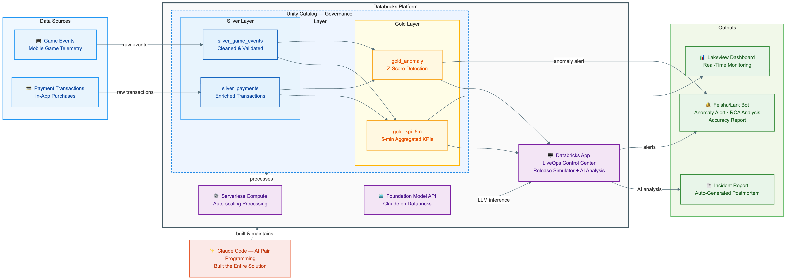
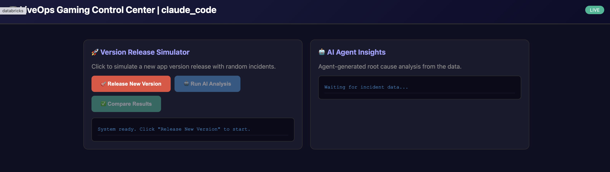
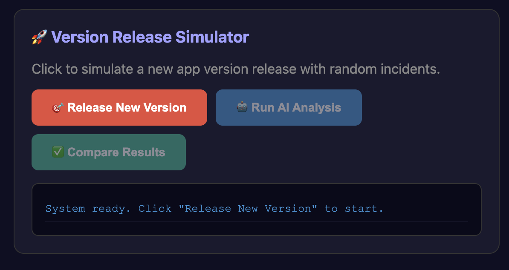
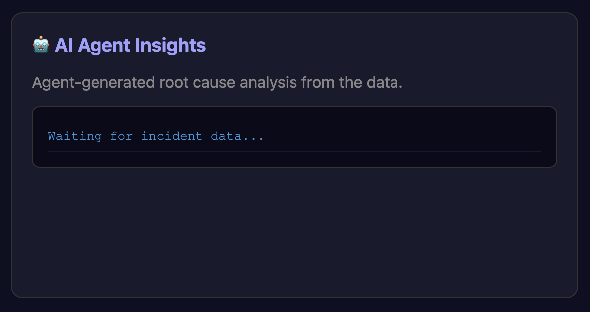
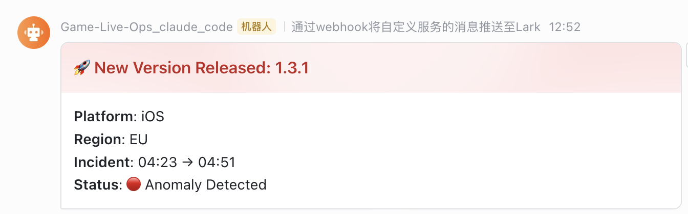
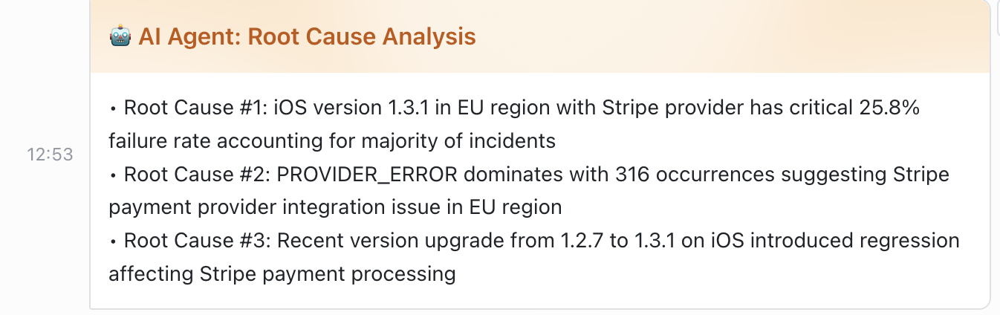
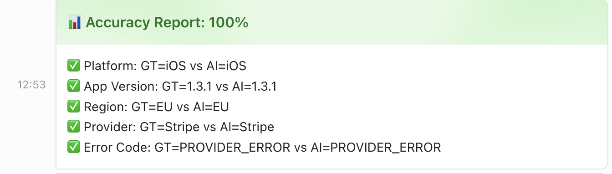

# LiveOps Gaming Platform | Databricks + Claude Code

> **"After a version release, revenue drops -- the platform auto-locates the root cause in 5 minutes, delivers actionable recommendations, and generates the incident report."**

---

## Business Problem

Mobile gaming companies face a critical operational challenge: **when a new app version is released, payment failures can spike silently**, causing revenue loss that goes undetected for hours. The traditional incident response process looks like this:

1. An on-call engineer notices a revenue dip on a dashboard (often 30-60 min delay)
2. A war room is assembled on Slack/Feishu with engineers, product, and ops (another 15-30 min)
3. Engineers manually query multiple tables, slicing by platform, app version, region, and payment provider (1-2 hours)
4. Root cause is identified, documented, and shared (another 30-60 min)

**Total time from incident to resolution: 2-4 hours.** During this time, thousands of players fail to complete purchases, revenue bleeds, and player trust erodes.

### Real-World Impact

| Metric | Before (Manual) | After (Automated) |
|--------|:---:|:---:|
| Time to detect anomaly | 30-60 min | < 5 min |
| Time to root cause | 2-4 hours | < 5 min |
| Incident report generation | 1-2 hours (manual) | Instant (AI-generated) |
| Team members needed | 5-8 people in war room | 0 (fully automated) |
| Revenue loss per incident | $$$ (hours of failed payments) | $ (minutes of failed payments) |

---

## Solution Overview

This platform automates the entire incident lifecycle -- from **detection** to **root cause analysis** to **reporting** -- on a single unified Databricks platform, with zero human intervention required.

### Key Value Propositions

- **5-Minute Resolution** -- Anomalies are detected in real-time via z-score analysis on 5-minute KPI buckets, and the GenAI agent immediately drills down across every dimension to pinpoint the root cause.
- **AI-Powered Root Cause Analysis** -- Databricks Foundation Model API (Claude on Databricks) analyzes multi-dimensional evidence tables and produces structured RCA with specific numbers, not generic suggestions.
- **Closed-Loop Automation** -- From anomaly detection to Feishu/Lark alert to RCA to incident report, the entire pipeline runs end-to-end without human intervention.
- **Governed by Unity Catalog** -- All data (silver, gold layers), all AI model calls, and all access controls are governed under Unity Catalog, ensuring compliance and auditability.
- **Built in Hours with Claude Code** -- The entire solution (4 notebooks + dashboard + app + bot integration) was built through AI pair programming with Claude Code, demonstrating rapid time-to-value.

---

## Architecture



```
                        ┌─────────────────────────────────────────────────────────┐
                        │                   Databricks Platform                    │
                        │  ┌───────────────────────────────────────────────────┐  │
                        │  │              Unity Catalog (Governance)            │  │
  ┌──────────────┐      │  │                                                   │  │
  │ Game Events  │──────│──│──▶ silver_game_events ──┐                         │  │
  │  (Telemetry) │      │  │                         ├──▶ gold_kpi_5m ─────┐  │  │
  ├──────────────┤      │  │                         │    (5-min buckets)   │  │  │
  │   Payment    │──────│──│──▶ silver_payments   ───┘                     │  │  │
  │ Transactions │      │  │                                               ▼  │  │      ┌──────────────────┐
  └──────────────┘      │  │                                        gold_anomaly │─│──────│Lakeview Dashboard│
                        │  │                                        (z-score)  │  │      └──────────────────┘
                        │  └───────────────────────────────────────────────────┘  │
                        │                          │                              │
                        │                          ▼                              │
                        │  ┌───────────────────────────────────────────────────┐  │      ┌──────────────────┐
                        │  │     Foundation Model API (Claude on Databricks)    │──│──────│  Feishu/Lark Bot │
                        │  │          GenAI Incident Copilot (RCA Agent)        │  │      │  (Alert Cards)   │
                        │  └───────────────────────────────────────────────────┘  │      └──────────────────┘
                        │                          │                              │
                        │                          ▼                              │      ┌──────────────────┐
                        │  ┌───────────────────────────────────────────────────┐  │      │ Incident Report  │
                        │  │   Databricks App (LiveOps Gaming Control Center)   │──│──────│ (Auto-Generated) │
                        │  │    Version Simulator + AI Analysis + Comparison    │  │      └──────────────────┘
                        │  └───────────────────────────────────────────────────┘  │
                        └─────────────────────────────────────────────────────────┘
                                          Built with Claude Code
```

### Technology Stack

| Component | Technology | Purpose |
|-----------|-----------|---------|
| Data Governance | **Unity Catalog** | Centralized access control, lineage, and audit for all tables and AI model calls |
| Data Processing | **Serverless Compute** | Zero-infrastructure data pipeline execution |
| Anomaly Detection | **Databricks SQL** | Z-score based detection on 5-minute KPI buckets with rolling baselines |
| GenAI RCA Agent | **Foundation Model API** | `ai_query('databricks-claude-sonnet-4-5', ...)` for structured root cause analysis |
| Real-Time Monitoring | **Lakeview Dashboard** | KPI trends, anomaly markers, error code breakdowns |
| Interactive App | **Databricks Apps** | FastAPI backend + web frontend for incident simulation and AI analysis |
| Team Notifications | **Feishu/Lark Webhook** | Interactive alert cards pushed to team chat at each incident stage |
| Development | **Claude Code** | AI pair programming -- entire solution built through conversational coding |

---

## Demo Walkthrough (12-15 min)

| Scene | Title | What Happens |
|:---:|-------|-------------|
| 1 | **Dashboard Overview** | Lakeview dashboard shows real-time KPIs: revenue trend, payment success rate, error codes, fail rate by platform. The audience sees a clear dip at 10:05. |
| 2 | **Anomaly Detection** | Z-score algorithm detects the anomaly automatically. Red alert card is pushed to Feishu with impact summary. |
| 3 | **GenAI RCA Agent** | Foundation Model API analyzes evidence across 5 dimensions (platform, version, region, provider, error code) and returns top 3 root causes with specific numbers. |
| 4 | **Root Cause Drill-Down** | Detailed breakdown: iOS 1.2.7 + SG + Stripe + TOKEN_EXPIRED identified as primary cause. Sample error logs displayed. |
| 5 | **Incident Report** | AI generates a complete postmortem: summary, timeline, impact, root cause, immediate actions, long-term fixes. |

---

## Databricks App

The **LiveOps Gaming Control Center** is a Databricks App that lets you simulate version releases, inject random incidents, run AI-powered root cause analysis, and compare AI results against ground truth.



| Version Release Simulator | AI Agent Insights |
|:---:|:---:|
|  |  |

**Flow:** Release New Version -> Anomaly Injected -> Run AI Analysis -> Compare Results (Ground Truth vs AI)

---

## Feishu/Lark Bot Integration

Automated alerts are sent to a Feishu group chat at each stage of the incident lifecycle:

| Anomaly Alert | AI Root Cause Analysis | Accuracy Report |
|:---:|:---:|:---:|
|  |  |  |

---

## Data Model

### Medallion Architecture

```
Raw Events ──▶ Silver (Cleaned) ──▶ Gold (Aggregated + Enriched)
```

| Layer | Table | Description |
|-------|-------|-------------|
| Silver | `silver_game_events` | Cleaned game telemetry: login, level_start, purchase_attempt, purchase_success, purchase_fail |
| Silver | `silver_payments` | Payment transactions with status, error codes, provider, platform, version, region |
| Gold | `gold_kpi_5m` | 5-minute aggregated KPIs by platform/version/region/provider: revenue, attempts, success rate |
| Gold | `gold_anomaly` | Anomaly detection results: z-scores, baseline comparison, estimated revenue impact |

### Anomaly Detection Method

- **Baseline**: Same time-of-day from previous days (288 buckets/day)
- **Detection**: Z-score < -3 flags an anomaly
- **Impact estimation**: `(baseline_rate - actual_rate) x attempts x avg_purchase_value`

---

## Repository Structure

```
.
├── 01_data_generation.py        # Synthetic data: 50K users, 3 days, injected incident
├── 02_anomaly_detection.py      # KPI aggregation + z-score anomaly detection
├── 03_incident_copilot.py       # GenAI RCA agent + incident report generation
├── feishu_bot_alerts.py         # Feishu interactive card alerts (Scenes 2-5)
├── liveops-app/                 # Databricks App
│   ├── app.py                   # FastAPI backend + HTML frontend
│   ├── app.yaml                 # App config (warehouse ID, webhook URL)
│   └── requirements.txt         # Python dependencies
├── images/                      # Screenshots and architecture diagram
└── README.md
```

## Getting Started

1. **Create catalog and schema:**
   ```sql
   CREATE CATALOG IF NOT EXISTS neo_claude_code;
   CREATE SCHEMA IF NOT EXISTS neo_claude_code.gaming;
   ```

2. **Run notebooks in order on Databricks:**
   - `01_data_generation.py` -- generates 3 days of synthetic data with incident at 10:05 today
   - `02_anomaly_detection.py` -- builds gold KPI tables and detects anomalies via z-score
   - `03_incident_copilot.py` -- runs GenAI RCA agent and generates incident report

3. **Deploy the Databricks App:**
   ```bash
   databricks apps create liveops-gaming-claude-code --profile <your-profile>
   databricks apps deploy liveops-gaming-claude-code --source-code-path liveops-app/ --profile <your-profile>
   ```

4. **Run Feishu alerts (optional):**
   - Update the webhook URL in `feishu_bot_alerts.py`
   - Run the notebook after anomaly detection completes

## License

See [LICENSE](LICENSE) for details.
